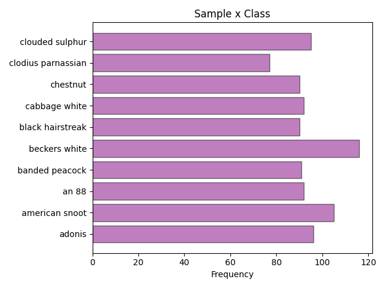
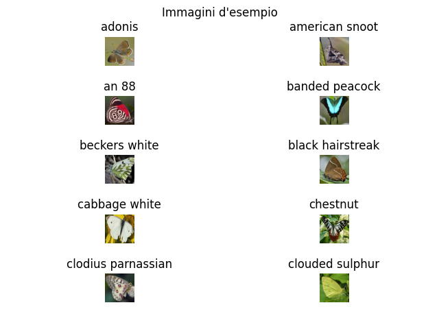
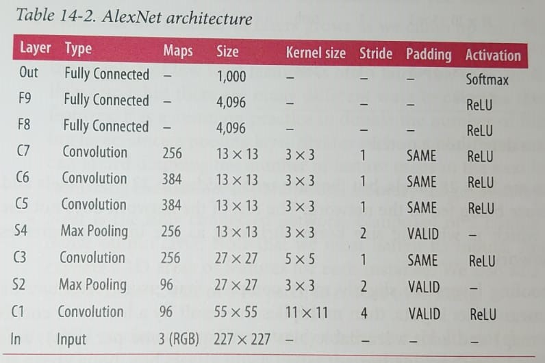
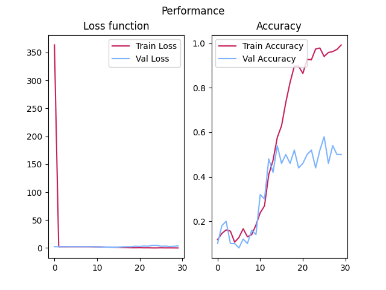
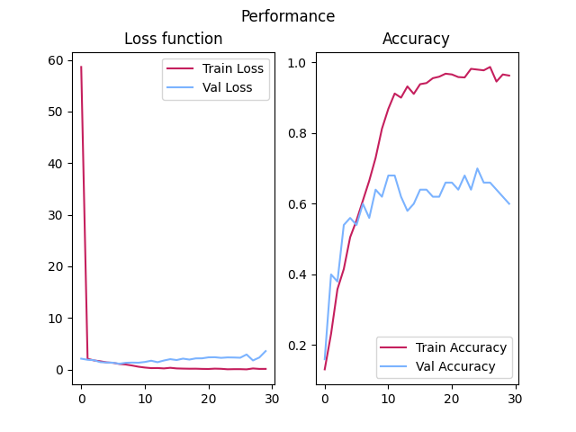
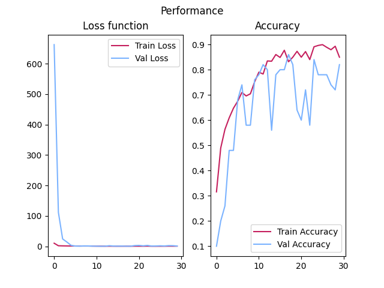

# *Alexnet - Classificazione di farfalle*

Per lo svolgimento della prova d'esame ho scelto di portare il seguente [dataset](https://www.kaggle.com/gpiosenka/butterfly-images40-species), trattante immagini di farfalle.
Per realizzare questo classificatore, ho scelto di usare una ***Convolutional Neural Network***.

- [Librerie utilizzate](#lib)
- [Dataset](#data)
  - [Come si presenta](#data2)
  - [Immagini d'esempio](#sample)
- [Architettura CNN](#cnn)
  - [Funzione di costo](#loss)
  - [Ottimizzatore](#opt)
- [Risultati](#ris)
  - [Apprendimento](#train)
  - [Test](#test)
- [Conclusioni](#con)

## *Librerie utilizzate*

---
Per la realizzazione di questo progetto sono state utilizzate le seguenti librerie:

- Numpy, per la gestione dei dati numerici.
- Pillow, per il trattamento delle immagini.
- Tensorflow, per l'implementazione della rete neurale.
- Matplotlib, per le visualizzazioni.

## *Dataset*

---
Il dataset inizialmente si presenta con un totale di **50** classi(non bilanciate), dove ogni immagine è di grandezza **224x224** pixel in formato **RGB**.
Data la poca disponibilità di risorse computazionali, ho deciso di creare un subset contenente soltanto **10** classi, di seguito illustro come si presenta. 

### *Come si presenta*
Il dataset di **training** ha un totale di **944** samples distribuiti nel seguente modo:

Infine il dataset di validazione e di test contengono rispettivamente **5** elementi per classe, per un totale di **50** samples.

### *Immagini d'esempio*
Di seguito possiamo vedere alcune immagini del subset che ho ottenuto

---

## *Architettura CNN*

---
L'archittetura della CNN è **Alexnet**, la rete realizzata da Alex Krizhevsky, vincitrice del ILSVRC 2012.

### *Funzione di costo*
Come funzione di costo è stata utilizzata la [Cross-entropy](https://machinelearningmastery.com/cross-entropy-for-machine-learning/)

### *Ottimizzatore*

---
Come ottimizzatore è stato utilizzato [Adam](https://keras.io/api/optimizers/adam/) con i valori di default di Keras.

## *Risultati*

---

### *Apprendimento*
Qui possiamo vedere i risultati di un Modello Alexnet a cui non sono state applicate tecniche di regolarizzazione e normalizzazione.

Il modello presenta un ***overfitting*** notevole, avendo un accuratezza nel training set pari al ***99%*** ed un accuratezza nel validation set pari al ***50%***.

Dati questi risultati risultati ho deciso di applicare una tecnica di regolarizzazione chiamata ***Dropout***.
Di conseguenza, gli ultimi due layer di neuroni densi hanno il ***50%*** di probabilità di non attivarsi in fase di training, riducendo così l'overfitting.

Infine, non essendo soddisfatto di aver portato il modello ad un acccuratezza del ***60%***, ho deciso di applicare degli strati di ***normalizzare*** le immagini prima di darle input alla rete e di introdurre degli strati di normalizzazione dopo ogni Convolutional layer.

Il modello finale raggiunge un accuratezza in fase di training pari al ***85%*** ed in fase di validation al ***82%***

### *Test*

---

In fase di test il modello presenta un accuracy del ***78%***

## *Conclusioni*

Nonostante le migliorie del modello durante le varie fasi, ritengo che si sarebbero ottenuti risultati ancora migliori applicando della ***Data Augmentation*** nei casi dove le classi erano in quantità minore, così da bilanciare il dataset.

Inoltre una migliore distribuzione dei samples tra training set e validation set avrebbe sicuramente contribuito ad incrementare le performance.
